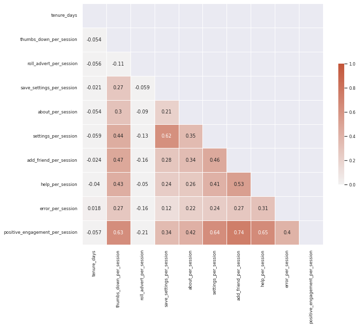
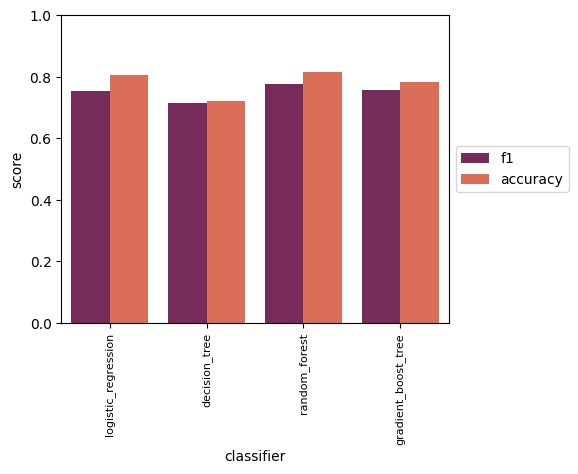
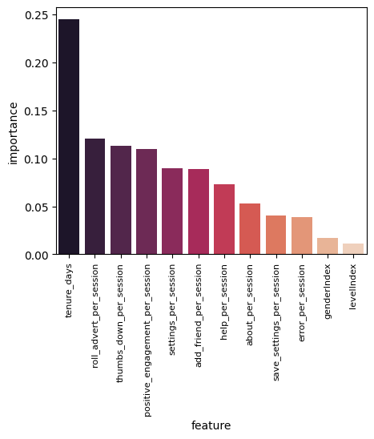

## Sparkify - use Spark and ML to predict churn

Author: Heng Li

### 1. Libraries used

* ```pyspark.sql```, ```numpy``` and ```pandas``` for data wrangling, computations and data imports/storage

* ```matplotlib``` and  ```seaborn``` for data visualization

* ```statsmodels.stats``` and ```pyspark.ml``` for statistical analyses and machine learning


### 2. Motivation

Sparkify is a music streaming service similar to Apple Music, Spotify, etc. The dataset provided is in the form of event logs when customers use the streaming services, including artists, songs, geolocation, timestamp, demographic infos, user actions etc.

The main goal of this project is to analyze the event log and build a machine learning model to predict the users who are more likely to cancel service (churn), and thus use this information in ad campaign to reduce customer out-flow.

In addition, due to the amount of data used, we leveraged spark (pySpark), spark SQL, spark ML and cloud service provided by IBM to perform data wrangling, exploration, and machine learning tasks.


### 3. Files in the repository:

```
└── spark-machine-learning-sparkify
	├── Sparkify_anonymized.ipynb
		  # entry point to the jupyter notebook code,
          # analyses, and visualizations
	├── README.md
					# readme file
	└── visualizations
	    ├── base.png   
						# baseline ML model performance
	    ├── boxplot.png   
						# boxplot showing column statistics
	    ├── cor1.png   
						# correlation matrix 1
	    ├── cor2.png   
						# correlation matrix 2
	    ├── cor3.png   
						# correlation matrix 3
	    ├── histplot.png   
						# histplot showing column statistics
	    ├── importance.png   
	          # feature importance ranking from tuned model
```

### 4. Summary of results and analyses
* **Feature engineering**:
  * Categorical features, such as gender and level of service were explored and analyzed by statistical approach. It was shown by two-side hypothesis testing,
  the observed differences in churn proportions for female/male or free/paid users
  are not significant.

      | churn  | gender | num_userId |
      |  --- | --- |--- |
      | 0 | F | 153 |
      | 0 | M | 196 |
      | 1 | F | 45 |
      | 1 | M | 54 |

      | churn  | level | num_userId |
      |  --- | --- |--- |
      | 0 | free | 288 |
      | 0 | paid | 246 |
      | 1 | free | 82 |
      | 1 | paid | 75 |

  * Numeric features related to customer tenure, user actions with streaming services, such as thumbs-down, receiving ads, checking home/about pages. In order to reduce multicollinearity, columns are either omitted or combined and normalized with respect to total sessions for each user.

	 
	 
* **Machine learning**:
  * Baseline performance of machine learning classifiers (Logistic Regression, Decision Tree, Random Forest, and Gradient Boost Tree) with default spark ML settings were compared. RandomForestClassifier performed best on validation set with F-1 score of 0.7761 and accuracy of 0.815, and it was chosen for model refinement.

    

  * Hyper-parameter tuning was performed on RandomForestClassifier. When compared with performance of default RandomForestClassifier, the performance on test set improved slightly to a F-1 score of 0.7066 and accuracy of 0.768.

  * Feature importance was also extracted from tuned model. Looking at feature importance ranking, we could see that customer tenure time is the most important, followed by user actions, such as receiving ads, thumb-downs, and positive engagements (add to playlist, nextsong, thumbs up). On the other side of the spectrum, gender and level of service are of least importance, which is in line with the hypothesis testing where the difference is not significant.

    

### Acknowledgements
1. Datasets are provided by Udacity Data Scientist Nanodegree program
2. Cloud service provided by IBM Cloud
